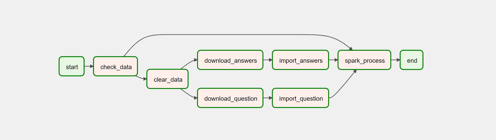

# Analyze User on Stack OverFlow

## Description
- Create a data pipeline:
  
  

- The dataset consists of two files: Questions and Answers. Download from google drive 
  
+ Questions contains all the questions on Stack Overflow in a certain time period, including: ID, Title, BodyQuestion, OwnerUserId, CreationDate, ClosedDate, Score

  
+ Answers contains all the answers to each question in Questions, and has the following fields: ID, BodyAnswer, QuestionID, OwnerUserId, CreationTime, Score

- Config Hadoop, Spark, Connect pySpark to MongoDB. Read, write data with MongoDB in Spark
- Analize some topic:
    
+ Count the number of times programming languages appear.

    
+ Find the most used domains in questions.

    
+ Calculate the total points of User by day.

    
+ Calculate the total number of points that User has achieved in a period of 

    
+ Find questions with many answers.

    
+ Find active users.

- To practice and learn about some tool to handle big data

## Technology and skill
- Apache Hadoop, Apache Spark, Apache Kafka, Apache Airflow
- MongoDB
